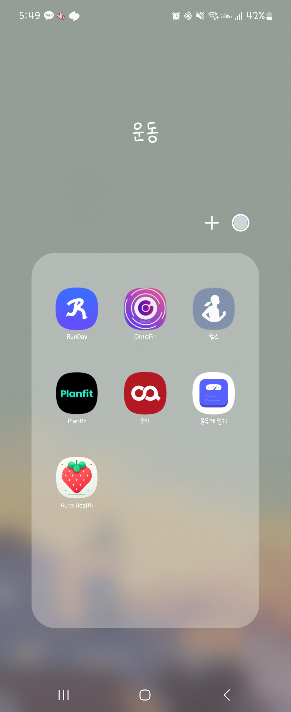
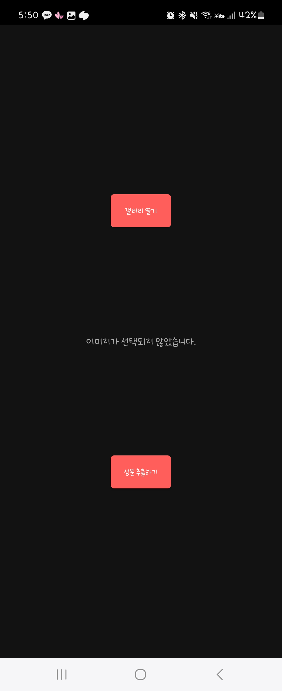
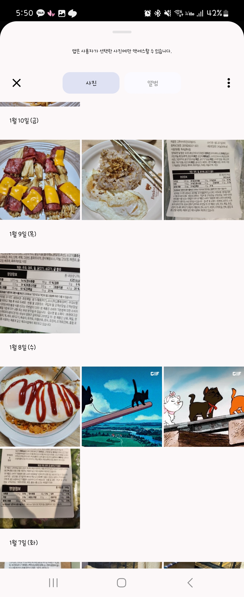
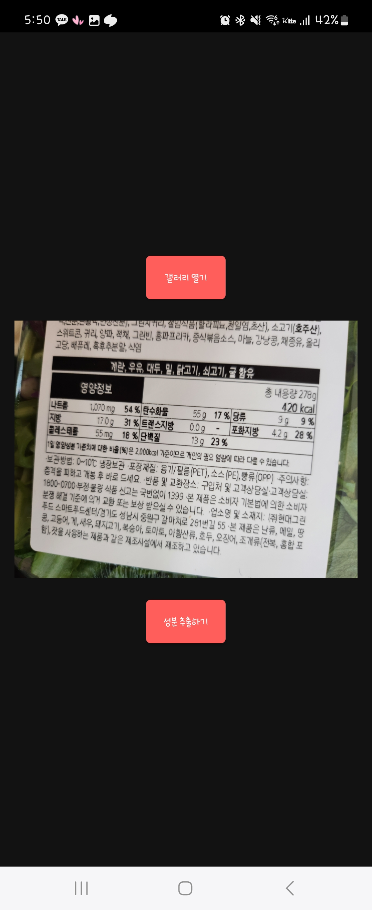
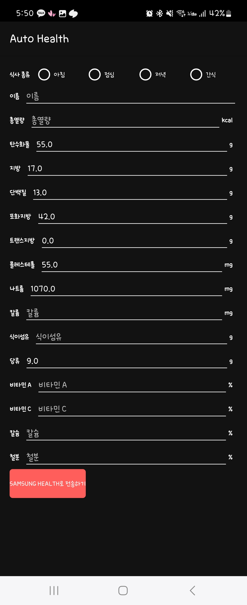
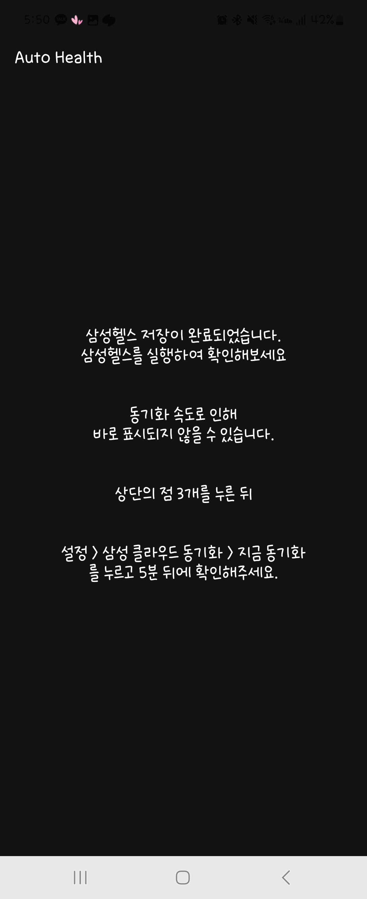
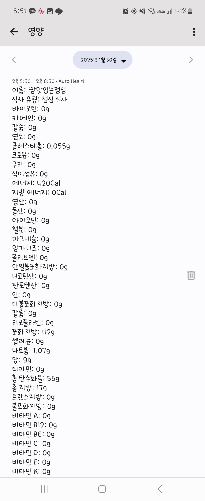

### 1. 제작 목적

삼성헬스에 등록되지 않은 개인 음식 (도시락 등등)을 편리하게 추가시켜보고자 만들었습니다.

### 2. 사용 기술

- android studio
- naver ocr
- kotlin

### 3. 실행 화면

앱을 클릭해줍니다.    

갤러리에서 성분표를 선택해줍니다.    

권한 허용 이후 이렇게 사진 선택 가능 화면이 뜹니다.    

원하는 사진을 선택한 이후 <strong>성분 추출하기</strong> 버튼을 클릭합니다.    

아침, 점심, 저녁, 간식 중 한 개를 선택하고 음식 이름과 칼로리를 작성합니다. 이후 <strong>삼성헬스</strong>로 전달하기를 누릅니다.     

해당 화면이 뜨면 정상적으로 OCR 추출이 된 것입니다.    

헬스커넥트 데이터베이스에 음식이 남아있으면 저장이 완료된 것입니다. 삼성헬스 동기화를 하면 추가된 것을 확인하실 수 있습니다.    
